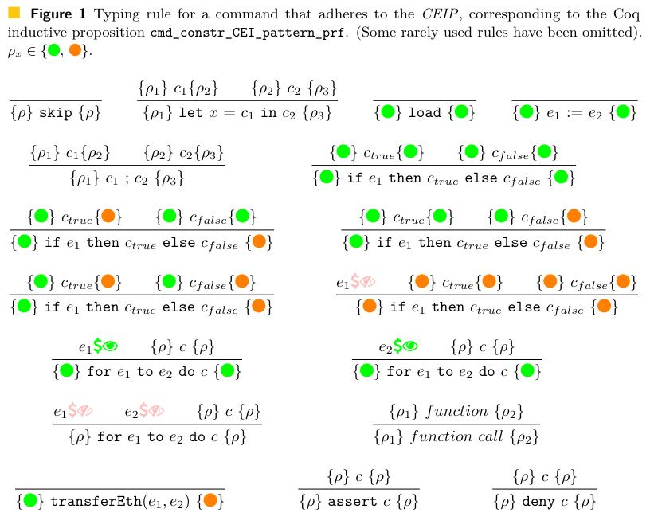

# On balance checking

A minor correction and additional work are discussed here. Note that this correction is not reflected in this code-base, but it has been incorporated into a more recent version of the code-base.

A contract reading a balance is similar to reading from storage and is only safe to do before an external call, when following the Checks-Effects-Interaction pattern. Originally this wasn't taken into account, but now it has been.

The diagram below shows an updated version of the typing rule reflecting this change (Figure 1 in the paper).

The eye and dollar icon that is pink indicates that the expression does not contain a call to read a balance, and the green eye and dollar icon indicates that the expression does. 



The key code changes added to perform this check is a function that checks if a call to read a balance is a part of an expression. This can be done as follows:

_Due to effects associated with commit 45f7b06e1c which has since been reverted in the main DeepSEA codebase, the changes below have not been made directly to this repository._

These lines would be added to `Syntax.v`:
```
Fixpoint contains_balance_read
    `{HyperTypeImpl}
    (e : expr_constr tp) {struct e} : bool :=
    match e with
  | ECconst_int _ _ _ _ => false
  | ECconst_int256 _ _ _ _ => false
  | ECtempvar _ _ _ => false
  | ECbuiltin0 _ _ possibly_balance_read =>
    match (@Hbuiltin0 LayerSpec _ possibly_balance_read) with
      | Bselfbalance => true
      | _ => false
    end
  | ECbuiltin1 _ _ _ _ possibly_balance_read e' => 
    match (@Hbuiltin1 LayerSpec _ _ possibly_balance_read) with
      | Bbalance => true
      | _ => false
    end
    || contains_balance_read e'
  | ECunop _ _ _ _ _ _ e' => contains_balance_read e'
  | ECbinop _ _ _ _ _ _ _ _ el er =>
    (contains_balance_read el) || (contains_balance_read er)
  end%type.
```

And then in the same file `cmd_contr_CEI_pattern_prf` would be altered to the following. With changes in particular that correspond to the diagram above.
```
Inductive cmd_constr_CEI_pattern_prf :

(*  Abbreviations:
      CEI = Checks-Effects-Interactions (pattern)
      cmd = command
      prf = proof
      CCCEIP___ = Command Constructor Check Effects Interactions (pattern) Proof ___
      r = return type (of the command)
      r1 = return type 1
      c1 = command 1
      rst = reentrancy safety state
      e = expression
  *)

  forall ret,
    checks_effects_interactions_pattern_state -> cmd_constr ret -> checks_effects_interactions_pattern_state -> Prop :=
    (* In the type of cmd_constr_CEI_pattern_prf, the first occurance of checks_effects_interactions_pattern_state corresponds to the checks_effects_interactions_pattern_state before executing the command, and the last checks_effects_interactions_pattern_state corresponds to the checks_effects_interactions_pattern_state after executing the command. *)
| CCCEIPskip :
    forall {rst},
      cmd_constr_CEI_pattern_prf _ rst CCskip rst
      (* "skip" leaves rst unchaged *)
| CCCEIPlet :
    forall {rst1} {rst2} {rst3} r `{ht : HyperType tp} id c1 c2,
      cmd_constr_CEI_pattern_prf (mk_hyper_type_pair tp) rst1 c1 rst2 ->
      cmd_constr_CEI_pattern_prf r rst2 c2 rst3 ->
      cmd_constr_CEI_pattern_prf r rst1 (CClet id c1 c2) rst3
      (* "let" leaves rst as the rst from running c1 then c2 *)
| CCCEIPload : 
    forall `{ht : HyperType tp} e,
      cmd_constr_CEI_pattern_prf _ Safe_no_reentrancy (CCload e) Safe_no_reentrancy
      (* "load" can only be run safely from Safe_no_reentrancy, and leaves it rst as Safe_no_reentrancy *)
      (* Note that e might contain a balance read, but there is no need to check in addition because load is already only safe in the same situation as a balance read is. *)
| CCCEIPstore :
    forall `{ht : HyperType tp} el er,
      cmd_constr_CEI_pattern_prf _ Safe_no_reentrancy (CCstore el er) Safe_no_reentrancy
      (* "store" can only be run safely from Safe_no_reentrancy, and leaves it rst as Safe_no_reentrancy *)
      (* Note that e might contain a balance read, but there is no need to check in addition because store is already only safe in the same situation as a balance read is. *)
| CCCEIPsequence :
    forall {rst1} {rst2} {rst3} r (c1 : cmd_constr void_unit_pair) (c2 : cmd_constr r),
      cmd_constr_CEI_pattern_prf void_unit_pair rst1 c1 rst2 ->
      cmd_constr_CEI_pattern_prf r rst2 c2 rst3 ->
      cmd_constr_CEI_pattern_prf r rst1 (CCsequence c1 c2) rst3
      (* "sequence" leaves rst as the rst from running c1 then c2 *)      

(* "ifthenelse" is split into the five allowable cases (rather than using a match statement) to simplify the type-checking. *)
(* Here we assume the worst case scenario, I guess it would be nice to be able to analyse the truth value of e here. *)
(* "ifthenelse" leaves rst as the rst from assuming the worst case scenario out of the commands in the branches *)
| CCCEIPifthenelse1 : (* Safe_no_reentrancy Safe_no_reentrancy Safe_no_reentrancy *)
  forall r e c_true c_false,
    cmd_constr_CEI_pattern_prf r Safe_no_reentrancy c_true Safe_no_reentrancy ->
    cmd_constr_CEI_pattern_prf r Safe_no_reentrancy c_false Safe_no_reentrancy ->
    cmd_constr_CEI_pattern_prf r Safe_no_reentrancy (CCifthenelse e c_true c_false) Safe_no_reentrancy
| CCCEIPifthenelse2 : (* Safe_no_reentrancy Safe_with_potential_reentrancy Safe_no_reentrancy *)
  forall r e c_true c_false,
    cmd_constr_CEI_pattern_prf r Safe_no_reentrancy c_true Safe_with_potential_reentrancy ->
    cmd_constr_CEI_pattern_prf r Safe_no_reentrancy c_false Safe_no_reentrancy ->
    cmd_constr_CEI_pattern_prf r Safe_no_reentrancy (CCifthenelse e c_true c_false) Safe_with_potential_reentrancy      
| CCCEIPifthenelse3 : (* Safe_no_reentrancy Safe_no_reentrancy Safe_with_potential_reentrancy *)
  forall r e c_true c_false,
    cmd_constr_CEI_pattern_prf r Safe_no_reentrancy c_true Safe_no_reentrancy ->
    cmd_constr_CEI_pattern_prf r Safe_no_reentrancy c_false Safe_with_potential_reentrancy ->
    cmd_constr_CEI_pattern_prf r Safe_no_reentrancy (CCifthenelse e c_true c_false) Safe_with_potential_reentrancy      
| CCCEIPifthenelse4 : (* Safe_no_reentrancy Safe_with_potential_reentrancy Safe_with_potential_reentrancy *)
  forall r e c_true c_false,
    cmd_constr_CEI_pattern_prf r Safe_no_reentrancy c_true Safe_with_potential_reentrancy ->
    cmd_constr_CEI_pattern_prf r Safe_no_reentrancy c_false Safe_with_potential_reentrancy ->
    cmd_constr_CEI_pattern_prf r Safe_no_reentrancy (CCifthenelse e c_true c_false) Safe_with_potential_reentrancy      
| CCCEIPifthenelse5 : (* Safe_with_potential_reentrancy Safe_with_potential_reentrancy Safe_with_potential_reentrancy *)
  forall r e c_true c_false,
    contains_balance_read e = false ->
    cmd_constr_CEI_pattern_prf r Safe_with_potential_reentrancy c_true Safe_with_potential_reentrancy ->
    cmd_constr_CEI_pattern_prf r Safe_with_potential_reentrancy c_false Safe_with_potential_reentrancy ->
    cmd_constr_CEI_pattern_prf r Safe_with_potential_reentrancy (CCifthenelse e c_true c_false) Safe_with_potential_reentrancy      
| CCCEIPfor1 :
forall id_it id_end e1 e2 c,
  contains_balance_read e1 || contains_balance_read e2 = true ->
  cmd_constr_CEI_pattern_prf _ Safe_no_reentrancy c Safe_no_reentrancy ->
  cmd_constr_CEI_pattern_prf _ Safe_no_reentrancy (CCfor id_it id_end e1 e2 c) Safe_no_reentrancy
  (* This is slightly overly restrictive, for example a for loop that actually only loops once and contains a transferEth call will not be allowed. *)
(* "for" probably loops through c many times, so to be safe we assume it can only be run safely if c is a command which results in rst (and starts from rst). Then the loop as a whole is only safe if started from rst and will result in a rst state. *)
| CCCEIPfor2 :
forall {rst} id_it id_end e1 e2 c,
  contains_balance_read e1 = false ->
  contains_balance_read e2 = false ->
  cmd_constr_CEI_pattern_prf _ rst c rst ->
  cmd_constr_CEI_pattern_prf _ rst (CCfor id_it id_end e1 e2 c) rst
  (* This is slightly overly restrictive, for example a for loop that actually only loops once and contains a transferEth call will not be allowed. *)
(* "for" probably loops through c many times, so to be safe we assume it can only be run safely if c is a command which results in rst (and starts from rst). Then the loop as a whole is only safe if started from rst and will result in a rst state. *)
| CCCEIPfirst1 :
    forall r id_it id_end id_dest e1 e2 c3 c4 c5,
      contains_balance_read e1 || contains_balance_read e2 = true ->
      cmd_constr_CEI_pattern_prf int_bool_pair Safe_no_reentrancy c3 Safe_no_reentrancy ->
      cmd_constr_CEI_pattern_prf r Safe_no_reentrancy c4 Safe_no_reentrancy ->
      cmd_constr_CEI_pattern_prf r Safe_no_reentrancy c5 Safe_no_reentrancy ->
      cmd_constr_CEI_pattern_prf r Safe_no_reentrancy
                    (CCfirst id_it id_end id_dest e1 e2 c3 c4 c5)
                    Safe_no_reentrancy
            (* Slightly over-restrictive, like for. Also the command that executes when the loop exits could move rst from Safe_no_reentrancy to Safe_with_potential_reentrancy, but this, being overly restrictive would not allow that (fairly unlikely) situation. *)
      (* With "first", similarly to "for" we assume all the commands (which may be looped) result in rst (and start from rst). So the overall first-loop is only safe if started from rst and will result in a rst state. *)
| CCCEIPfirst2 :
forall {rst} r id_it id_end id_dest e1 e2 c3 c4 c5,
  contains_balance_read e1 = false ->
  contains_balance_read e2 = false ->
  cmd_constr_CEI_pattern_prf int_bool_pair rst c3 rst ->
  cmd_constr_CEI_pattern_prf r rst c4 rst ->
  cmd_constr_CEI_pattern_prf r rst c5 rst ->
  cmd_constr_CEI_pattern_prf r rst
                (CCfirst id_it id_end id_dest e1 e2 c3 c4 c5)
                rst
        (* Slightly over-restrictive, like for. Also the command that executes when the loop exits could move rst from Safe_no_reentrancy to Safe_with_potential_reentrancy, but this, being overly restrictive would not allow that (fairly unlikely) situation. *)
  (* With "first", similarly to "for" we assume all the commands (which may be looped) result in rst (and start from rst). So the overall first-loop is only safe if started from rst and will result in a rst state. *)
| CCCEIPfold1 :
  forall `{ht : HyperType tp} id_it id_end id_recur id_dest e1 e2 e3 c,
    contains_balance_read e1 || contains_balance_read e2 || contains_balance_read e3 = true ->
    cmd_constr_CEI_pattern_prf _ Safe_no_reentrancy c Safe_no_reentrancy ->
    cmd_constr_CEI_pattern_prf _
      Safe_no_reentrancy
      (CCfold id_it id_end id_recur id_dest e1 e2 e3 c)
      Safe_no_reentrancy
      (* Similarly to CCCEIPfor, this is overly restrictive. *)
  (* With "fold", similarly to "for" and "first" we assume all the commands (which may be looped) result in rst (and start from rst). So the overall fold is only safe if started from rst and will result in a rst state. *)
| CCCEIPfold2 :
  forall `{ht : HyperType tp} {rst} id_it id_end id_recur id_dest e1 e2 e3 c,
    contains_balance_read e1 = false ->
    contains_balance_read e2 = false ->
    contains_balance_read e3 = false ->
    cmd_constr_CEI_pattern_prf _ rst c rst ->
    cmd_constr_CEI_pattern_prf _
      rst
      (CCfold id_it id_end id_recur id_dest e1 e2 e3 c)
      rst
      (* Similarly to CCCEIPfor, this is overly restrictive. *)
(* With "fold", similarly to "for" and "first" we assume all the commands (which may be looped) result in rst (and start from rst). So the overall fold is only safe if started from rst and will result in a rst state. *)
| CCCEIPcall1 :
    forall {rst1} {rst2} r argt prim arg,
      rst1 = prim.(PRIMrst_before_A argt r) -> rst2 = prim.(PRIMrst_after_A argt r) -> cmd_constr_CEI_pattern_prf r rst1 (CCcall prim arg) rst2
| CCCEIPcall2 :
    forall {rst1} {rst2} r argt prim arg (IHprim : @primitive_prf _ _ argt r prim),
      rst1 = prim.(PRIMrst_before_B argt r)-> rst2 = prim.(PRIMrst_after_B argt r) -> cmd_constr_CEI_pattern_prf r rst1 (CCcall prim arg) rst2
    (* "call" should result in the same rst as the primitive being called, and be safe to call in the same circumstances as the primitive is called.
        The primitives will have automatically generated fields rst_before/after_A/B to describe the safe ways in which prim can be called. *)
(* | CCCEIPcall_ext : 
        (* Note: this should be similar to CCCEIPtransfer and also to CCPcall_ext *)
*)
| CCCEIPyield1 :
  forall `{ht : HyperType tp} e,
    contains_balance_read e = true ->
      cmd_constr_CEI_pattern_prf _ Safe_no_reentrancy (CCyield e) Safe_no_reentrancy
    (* If a balance is read in the expression "yield" is only safe before potential reentrancy. *)
| CCCEIPyield2 :
  forall {rst} `{ht : HyperType tp} e,
    contains_balance_read e = false ->
    cmd_constr_CEI_pattern_prf _ rst (CCyield e) rst
    (* "yield" retains the current rst as long as the expression does not read a balance. *)
| CCCEIPconstr :
    forall `{ht : HyperType tp} fld_ids fld_tps el flds constr,
      cmd_constr_CEI_pattern_prf _ Safe_no_reentrancy (CCconstr fld_ids fld_tps el flds constr) Safe_no_reentrancy
      (* "constr" assigns to storage so can only be called if Safe_no_reentrancy, and does not introduce the possiblity of reentrancy itself. *)
| CCCEIPtransfer :
    forall e1 e2,
      cmd_constr_CEI_pattern_prf _ Safe_no_reentrancy (CCtransfer e1 e2) Safe_with_potential_reentrancy
      (* What this is all about, "transfer" can only be called in a Safe_no_reentrancy state and DOES introduce potential reentrancy. *)
| CCCEIPassert :
    forall {rst1} {rst2} c,
      cmd_constr_CEI_pattern_prf _ rst1 c rst2 -> cmd_constr_CEI_pattern_prf _ rst1 (CCassert c) rst2
    (* "assert" results in the same rst (and can be called safely in the same situations as) the command c *)
| CCCEIPdeny :
    forall {rst1} {rst2} c,
      cmd_constr_CEI_pattern_prf _ rst1 c rst2 -> cmd_constr_CEI_pattern_prf _ rst1 (CCdeny c) rst2
  (* "deny" results in the same rst (and can be called safely in the same situations as) the command c *)
| CCCEIPpanic :
    forall {rst} `{ht : HyperType},
      cmd_constr_CEI_pattern_prf _ rst (CCpanic tp) rst
  (* "panic" retains the current rst *)
| CCCEIPrespec :
    forall {rst1} {rst2} r tmp' c spec,
      cmd_constr_CEI_pattern_prf r rst1 c rst2 -> 
      cmd_constr_CEI_pattern_prf r rst1 (CCrespec tmp' c spec) rst2
  (* "respec" results in the same rst (and can be called safely in the same situations as) the command c *)
| CCCEIPrespec_opt : 
    forall {rst1} {rst2} r tmp' c spec,
      cmd_constr_CEI_pattern_prf r rst1 c rst2 -> 
      cmd_constr_CEI_pattern_prf r rst1 (CCrespec_opt tmp' c spec) rst2
  (* "respec_opt" results in the same rst (and can be called safely in the same situations as) the command c *)
.
```