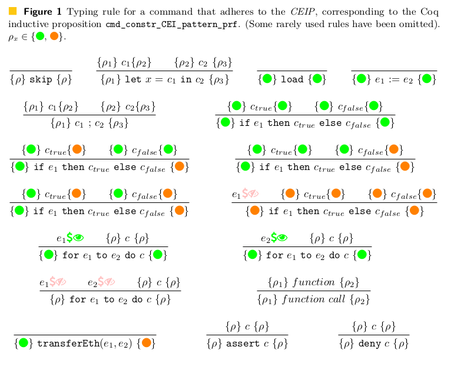

# Checks-Effects-Interactions pattern

The Checks-Effects-Interactions Pattern (abbreviated as CEIP in some places in the codebase) described [here (for example)](https://docs.soliditylang.org/en/v0.8.10/security-considerations.html#use-the-checks-effects-interactions-pattern) essentially involves carrying out "checks" and "effects" (all state modification) _before_ interactions (such as calling another contract, or transferring ether - which [could invoke contracts](Transferring-Ether-can-invoke-contracts.md)). Following this pattern protects the contract from a range of reentrancy-related exploits (including one used in [the DAO exploit](https://dev.to/zaryab2000/the-significance-of-check-effects-interaction-pattern-5hn6)).

In DeepSEA, the Checks-Effects-Interactions Pattern is enforced by Coq. Automatic proofs are attempted to solve a goal of the form `method_name_follows_CEIP` for each method. This relates to [the definition `CEIP_prf` in Syntax.v](/coqdoc/DeepSpec.core.Syntax.html#CEIP_prf) shown below.

<iframe style="width:100%" src="/coqdoc/DeepSpec.core.Syntax.html#CEIP_prf"></iframe>
 
This corresponds to the diagram below. (Note that this diagram has been updated since the paper mentioned below was published). Green corresponds to `CEIP_green`, Orange corresponds to `CEIP_orange`. The green dollar and eye icon indicates that the expression does not contain a call to read a balance, and pink dollar and eye indicates that the expression does. Reading a balance is similar to reading from storage and is only safe to do before an external call, when following the CEIP.

## Paper: Formal Methods for Blockchains Workshop, at CAV 2021

The core aspects of this were presented at FMBC 2021. [Feel free to download the paper from here (open access)](https://doi.org/10.4230/OASIcs.FMBC.2021.3).